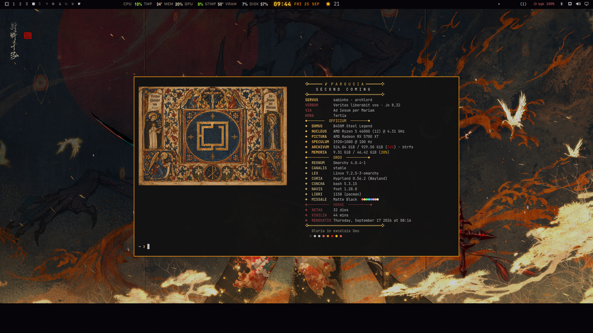

<p align="center">
  
</p>

<h1 align="center">☧ PAROUSIA</h1>

<p align="center">
  <b><i>S E C O N D &nbsp; C O M I N G</i></b><br/>
  <em>Medieval, liturgical fastfetch banner for Omarchy / Arch Linux</em>
</p>

<p align="center">
  <a href="#preview">Preview</a> ·
  <a href="#install">Install</a> ·
  <a href="#configuration">Configuration</a> ·
  <a href="#customization">Customization</a>
</p>

<div align="center">

| | |
|---|---|
| fastfetch | `fastfetch >= 2.x` |
| License | MIT |
| Style | Late-medieval Latin, gold &amp; wine |

</div>

> *Veritas liberabit vos · Jo 8,32 — Ad Iesum per Mariam*

---

## What is this?

A system-info banner that reads like a page out of a medieval tympanum.
Your specs, rendered as monastic **`OFFICIUM`** — with the **canonical hours
of the Divine Office** instead of a boring clock.

Gold `#e0b45a` and deep wine `#8b3a42` over a hand-crafted ASCII emblem.

---

## Preview

<p align="center">
  
  <br/>
  <em>Parousia running in a foot terminal</em>
</p>

<details>
<summary>Layout diagram (ASCII)</summary>

```
 ┌────────────────────────────────────────────────┐
 │  ❖═══════ ☧  P A R O U S I A ═══════❖         │
 │        S E C O N D   C O M I N G              │
 │  ❖══════════════════════════════════════❖     │
 │    SERVUS      sabinho · arch                 │
 │    VERBUM      Veritas liberabit vos · Jo 8,32 │
 │    VIA         Ad Iesum per Mariam            │
 │    HORA        Completorium                   │
 │  ◆───────────  OFFICIUM  ───────────◆         │
 │    ◆  DOMUS       sabinho                     │
 │    ◆  NUCLEUS     AMD Ryzen 7 7800X3D         │
 │    ◆  PICTURA     AMD Radeon RX 7800 XT       │
 │    ◆  SCRIPTUM    Arch Linux                  │
 │    ◆  LUCERNA     foot · Wayland              │
 │    ◆  MEMORIA     31.1 GiB / 62.7 GiB         │
 │    ◆  LABOR      uptime 3 days                │
 │    ◆  ANIMUS      shell bash · zsh            │
 └────────────────────────────────────────────────┘
```

</details>

The `HORA` module is alive — it answers with the current canonical hour
driven by your wall clock:

| Time (h) | Hour of the Office |
|:--------:|:-------------------|
| 00–04 | **Matutinum** |
| 05 | **Laudes** |
| 06–08 | **Prima** |
| 09–11 | **Tertia** |
| 12–14 | **Sexta** |
| 15–16 | **Nona** |
| 17–19 | **Vesperae** |
| 20–23 | **Completorium** |

---

## Install

Requires [fastfetch](https://github.com/fastfetch-cli/fastfetch).

**Arch / Omarchy**

```bash
sudo pacman -S --needed fastfetch
git clone https://github.com/Gedankenn/parousia.git ~/.local/share/parousia
mkdir -p ~/.config/fastfetch
cp ~/.local/share/parousia/fastfetch/* ~/.config/fastfetch/
fastfetch
```

**Any other distro**

```bash
git clone https://github.com/Gedankenn/parousia.git
mkdir -p ~/.config/fastfetch
cp parousia/fastfetch/* ~/.config/fastfetch/
fastfetch
```

> The config expects the logo at `~/.config/fastfetch/omarchy_medieval_logo.six`.
> Move files wherever you like — just update `logo.source` in `config.jsonc`.

### Show it in every new terminal

**bash** (`~/.bashrc`)

```bash
# Parousia banner — skip non-interactive / agent sessions to stay script-friendly
if [[ -t 1 && ${TERM:-} != dumb && -z ${GROK_AGENT:-} ]] && command -v fastfetch >/dev/null; then
  fastfetch
fi
```

**zsh** (`~/.zshrc`)

```zsh
if [[ -t 1 && ${TERM:-} != dumb ]] && whence -w fastfetch >/dev/null; then
  fastfetch
fi
```

**fish** (`~/.config/fish/config.fish`)

```fish
if isatty stdout; and command -q fastfetch
    fastfetch
end
```

---

## Configuration

The whole banner is a single file: `~/.config/fastfetch/config.jsonc`.

| File | Purpose |
|------|---------|
| `config.jsonc` | Logo, palette, keys, modules, layout |
| `omarchy_medieval_logo.six` | The sixel ASCII emblem |
| `omarchy_medieval_logo.png` | Inline preview of the emblem for this README |

**Layout definition** (`config.jsonc`)

| Option | Value | Meaning |
|--------|-------|---------|
| `logo.type` | `"raw"` | Use the ASCII/sixel emblem, not distro art |
| `logo.source` | `"~/.config/fastfetch/..."` | Where the `.six` lives |
| `logo.width/height` | `72 × 23` | Render box of the emblem |
| `display.key.width` | `16` | Tab width before values |
| `display.color.keys` | `38;2;224;180;90` | Gold for keys |
| `display.color.title` | `38;2;244;237;224` | Ivory for headings |

---

## Customization

**Palette.** Every color is an ANSI true-color triple `38;2;r;g;b`.
Change `display.color.*` and each `keyColor`:

| Tone | RGB |
|------|-----|
| Gold | `224;180;90` |
| Ivory | `244;237;224` |
| Wine | `139;58;66` |

**Keys.** Rename or drop any key in `config.jsonc` — `SERVUS`, `NUCLEUS`,
`PICTURA`, … or add your own with a `custom` module:

```jsonc
{
  "type": "custom",
  "key": "  PATER",
  "keyColor": "38;2;224;180;90",
  "format": "Ave Maria, gratia plena"
}
```

**Logo.** Swap `omarchy_medieval_logo.six` for your own emblem, then adjust
`logo.width` / `logo.height` to its rendered size.

---

## License

**MIT** — use it, remix it, print it on a banner.

<p align="center">
  <i>soli Deo honor et gloria</i>
</p>