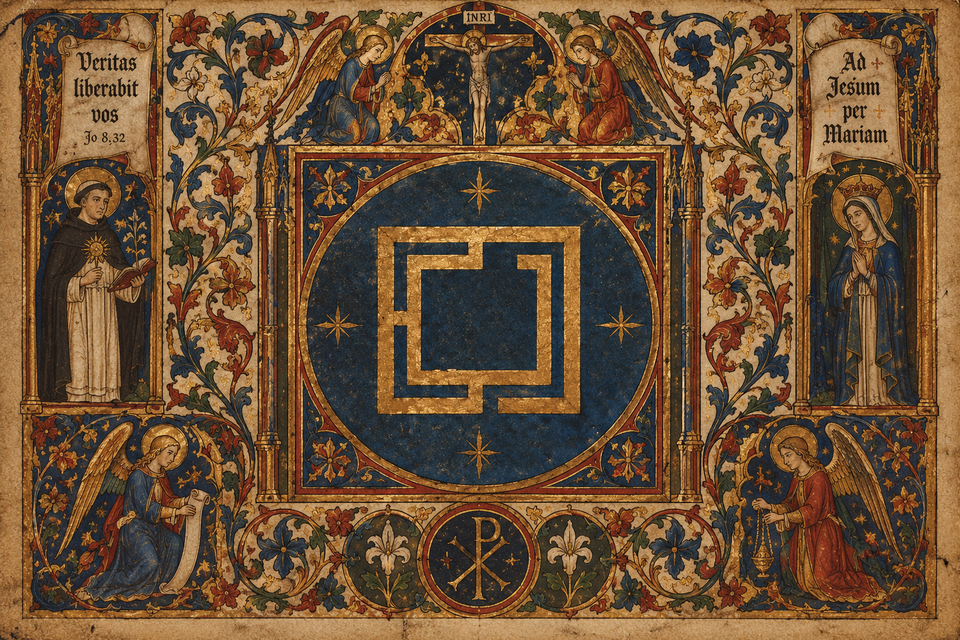

# Parousia — fastfetch banner

Medieval, liturgical fastfetch banner for Omarchy / Arch Linux.

> *Veritas liberabit vos · Jo 8,32 — Ad Iesum per Mariam*



Renders a Latin-themed system overview with the canonical hours of the
Divine Office instead of a boring clock. Gold `#e0b45a` and dark red
`#8b3a42` palette over a custom ASCII logo.

```
 ❖═══════ ☧  P A R O U S I A ═══════❖
      S E C O N D   C O M I N G
 ❖══════════════════════════════════❖
   SERVUS     sabinho · arch
   VERBUM     Veritas liberabit vos · Jo 8,32
   VIA        Ad Iesum per Mariam
   HORA       Completorium
 ◆────────  OFFICIUM  ────────◆
   ◆  DOMUS      sabinho
   ◆  NUCLEUS    AMD Ryzen 7 ...
   ◆  PICTURA    AMD Radeon ...
   ...
```

`HORA` shows the current canonical hour by wall time:

| Time | Hour |
|------|------|
| 00-04 | Matutinum |
| 05 | Laudes |
| 06-08 | Prima |
| 09-11 | Tertia |
| 12-14 | Sexta |
| 15-16 | Nona |
| 17-19 | Vesperae |
| 20-23 | Completorium |

## Install

Requires [fastfetch](https://github.com/fastfetch-cli/fastfetch).

```bash
git clone https://github.com/<you>/parousia.git
mkdir -p ~/.config/fastfetch
cp parousia/fastfetch/omarchy_medieval_logo.six ~/.config/fastfetch/
cp parousia/fastfetch/config.jsonc ~/.config/fastfetch/
fastfetch
```

The config expects the logo at `~/.config/fastfetch/omarchy_medieval_logo.six`
(edit the `logo.source` path in `config.jsonc` if you keep them elsewhere).

### Show on every new terminal

Add to `~/.bashrc` (skips non-interactive/agent sessions so scripts stay
usable):

```bash
if [[ -t 1 && ${TERM:-} != dumb && -z ${GROK_AGENT:-} ]] && command -v fastfetch >/dev/null; then
  fastfetch
fi
```

## Customize

Edit `fastfetch/config.jsonc`:

- **Colors** — `display.color.keys` / `.title` and every `keyColor`
  (ANSI `38;2;r;g;b`). Gold is `224;180;90`, dark red is `139;58;66`.
- **Keys** — change the Latin labels (`SERVUS`, `NUCLEUS`, …) or delete
  modules.
- **Logo** — replace `omarchy_medieval_logo.six` and adjust
  `logo.width/height`.

## License

MIT — do what you want, *soli Deo honor et gloria*.